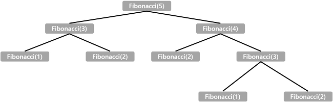

# 2747 : 피보나치 수열

재귀함수를 써보고자 문제 선택

프로그래머스 문제 풀려고,, (https://github.com/kcloud721/TIL/tree/master/algorithms/programmers/42746)


## 나의 풀이

### sol. 1

일단 걍 생각나는대로 for문 사용

```java
int prev1 = 1, prev2 = 0;
		for(int i=0; i<=n; i++) {
			if(i < 2) {
				piv = i;
			} else {
				piv = prev1 + prev2;
				prev2 = prev1;
				prev1 = piv;
			}
		}
```


### sol. 3

재귀함수 사용 : 함수를 새로 만들고 return에 자기 자신을 다시 호출하는 개념

```java
public static int pvnch(int n) {
		if(n < 2) 
			return n;
		else 
			return pvnch(n-1) + pvnch(n-2);
	}
```

이 코드로 제출했더니 "시간초과" 로 틀렸다.

이유는 아래 짤로 설명 가능



출처 : https://nackwon.tistory.com/49

검색해보면 이 문제에서 시간초과로 틀린 대부분의 사람들이 재귀함수를 쓰는게 아니라고들 하는데, 그게 아니라 중복된 함수를 너무 많이 호출하는 부분에서 비효율이 발생한 것이다. 

위 그림만 봐도 `Fibonacci(2)` 함수가 세 번이나 수행된다. 때문에 한 번 수행한 함수 결과를 저장해놓으면 된다고 함!


### sol.4 

* 힌트 : https://javacoding.tistory.com/79

* 목적 : 한 번 수행한 연산 결과를 메모리에 저장해놓고 불러옴으로써 함수의 중복실행을 방지

  `동적계획법` , `Memoiztion` 이라고도 하나봄?

* 풀이

  1. HashMap에서 Key 값이 존재하는지 확인

     `getOrDefault(Key, Default)` : Key값 존재하면 Value를 반환 / 존재하지 않으면 Default 값 반환

     이 문제에선 자연수만 주어지므로 Default 값을 0으로 지정하였다

  2. getOrDefault 반환값이을 통해 HashMap에 저장되지 않은 Key 값 구분

  3. HashMap에 존재하지 않으면 피보나치 연산 결과값을 `put()` 

  4. `get()` 반환값을 return

```java
public class Q2747_sol4 {
	static HashMap<Integer, Integer> map = new HashMap();

	public static void main(String[] args) {
		
//		Scanner sc = new Scanner(System.in);
//		int n = sc.nextInt();
		int n = 10;
		
		System.out.println(fibo(n));
	}
	
	public static int fibo(int n) {
		if(n < 2) {
			if(map.getOrDefault(n, 0) == 0)	// 값이 존재하지 않을 때 해시맵 저장 
				map.put(n, n);
		} else {
			if(map.getOrDefault(n, 0) == 0)	// 값이 존재하지 않을 때 해시맵 저장 
				map.put(n, fibo(n-1) + fibo(n-2));
		}
		return map.get(n);
	}
}
```

sol. 1의 for문 풀이는 120ms, sol. 4의 재귀함수 풀이는 114ms 로 재귀함수 풀이가 조금 더 빨랐다.


예전에 공부한 HashMap을 여기서 써봤음. 그때 getOrDefualt 뭔말인지 몰랐는데 필요해서 쓰니까 한 번에 이해됐다! 좋은거 배웠다 오늘 🥰


