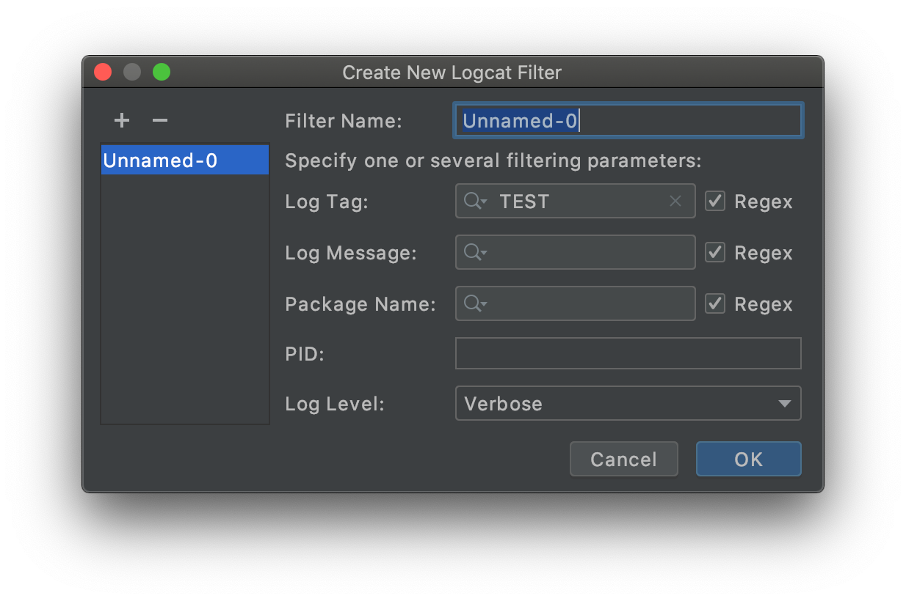
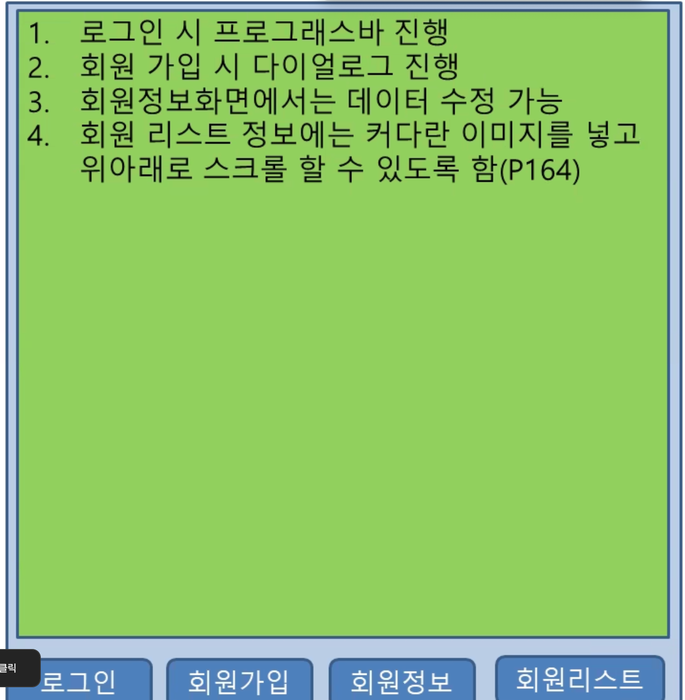

p200 : 이벤트 처리

p207 : 단말 방향 전환 (가로모드)

p217 : 토스트, 스낵바, 대화상자 사용

p233 : 프로그레스바, 시크바

p244 : 화면전환 Inflater

p245 : 워크샵

# 이벤트 처리

project : p196

오른버튼

Generate > Override Methods > onKey~

```java
@Override
    public boolean onKeyDown(int keyCode, KeyEvent event) {
        return super.onKeyDown(keyCode, event);
    }
```

## 로그 추적하기

Android Studio 의 Logcat 윈도우 사용

```java
Log.d("[TEST]","onDestory");
```



Log Tag에 `TEST` 입력해서 필터링 걸면

```bash
2020-10-13 13:02:27.258 16559-16559/com.example.p207 D/[TEST]: onCreate
2020-10-13 13:02:27.299 16559-16559/com.example.p207 D/[TEST]: onStart
2020-10-13 13:03:51.772 16926-16926/com.example.p207 D/[TEST]: onCreate
2020-10-13 13:03:51.806 16926-16926/com.example.p207 D/[TEST]: onStart
2020-10-13 13:04:51.375 16926-16926/com.example.p207 D/[TEST]: onStop
```

내가 설정한 로그만 보임


## 단말 방향 전환했을 때

p.207

* 앱 실행시 : onCreate() ▷ onStart ()
* 앱 종료시 : onStop() ▷onDestroy

# 토스트, 스낵바, 대화상자 사용하기

project : p217

## 1. 토스트

```java
public void clickb1(View v){
    Toast t = Toast.makeText(this,"Toast1 ...", Toast.LENGTH_SHORT);
    //t.setGravity(50,50,100);
    t.setGravity(Gravity.CENTER,0,0); // Gravity가 시작점
    t.show();
}
```

## 2. 커스텀 토스트

```java
public void clickb2(View v){    // Toast 커스텀
    LayoutInflater inflater = getLayoutInflater();   // 먼저 화면을 만듦
    View view = inflater.inflate(R.layout.toast, (ViewGroup) findViewById(R.id.toast_custom));
    TextView tv = view.findViewById(R.id.textView);
    tv.setText("INPUT TEXT");

    Toast t = new Toast(this);  // 만든 화면을 표시
    t.setGravity(Gravity.CENTER,0,0);
    t.setDuration(Toast.LENGTH_LONG);
    t.setView(view);
    t.show();
}
```

## 3. 스낵바

템플릿 다운로드가 선행되어야 함

activity_main.xml 에서 `Palette ▷ Containers ▷ AppBarLayout` 을 화면에 위치시키면 자동 다운로드

```java
public void clickb3(View v){
    Snackbar.make(v, "Snack Bar Test", Snackbar.LENGTH_LONG).show();
}
```

## 4. Alert 다이얼로그

```java
public void clickb4(View v){
    AlertDialog.Builder builder = new AlertDialog.Builder(this);
    builder.setTitle("My Dialog");
    builder.setMessage("Exit Now");
    builder.setIcon(R.drawable.img);

    builder.setPositiveButton("OK", new DialogInterface.OnClickListener() {
        @Override
        public void onClick(DialogInterface dialog, int which) {
            finish();
        }
    });
    builder.setNegativeButton("NO", new DialogInterface.OnClickListener() {
        @Override
        public void onClick(DialogInterface dialog, int which) {

        }
    });

    AlertDialog dialog = builder.create();
    dialog.show();
}
```

## 5. Alert 다이얼로그 + 커스톰 토스트

뒤로가기 버튼 클릭시 커스텀토스트로 다이얼로그 표시

```java
@Override
public void onBackPressed() {
    //super.onBackPressed(); -- 이게 있으면 바로 종료되네
    LayoutInflater inflater = getLayoutInflater();   // 먼저 화면을 만듦
    View view = inflater.inflate(R.layout.toast, (ViewGroup) findViewById(R.id.toast_custom));

    AlertDialog.Builder builder = new AlertDialog.Builder(this);
    builder.setTitle("My Dialog");
    builder.setMessage("Exit Now");
    builder.setView(view);
    builder.setIcon(R.drawable.img);

    builder.setPositiveButton("OK", new DialogInterface.OnClickListener() {
        @Override
        public void onClick(DialogInterface dialog, int which) {
            finish();
        }
    });
    builder.setNegativeButton("NO", new DialogInterface.OnClickListener() {
        @Override
        public void onClick(DialogInterface dialog, int which) {

        }
    });
    AlertDialog dialog = builder.create();
    dialog.show();
}
```


# Progress Bar

project : p233

activity_main.xml 에서 bar형 progress bar, 버튼 2개(5, 6) 추가

### 초기화

```java
public class MainActivity extends AppCompatActivity {

    ProgressBar progressBar;

    @Override
    protected void onCreate(Bundle savedInstanceState) {
        super.onCreate(savedInstanceState);
        setContentView(R.layout.activity_main);
        progressBar = findViewById(R.id.progressBar);
    }
```

### 함수 및 동작 선언

```java
public void btprogress(View v){
    if(v.getId() == R.id.button5){
        int pdata = progressBar.getProgress();
        progressBar.setProgress(pdata + 1);
    } else if(v.getId() == R.id.button6){
        int pdata = progressBar.getProgress();
        progressBar.setProgress(pdata - 1);
    }
}
```

함수 생성 후 activity_main.xml 에서 버튼에 onClick 옵션 매칭 필수 (btprogress)


# 시크바와 프로그레스바 보여주기

project: p233

```java
@Override
    protected void onCreate(Bundle savedInstanceState) {
        super.onCreate(savedInstanceState);
        setContentView(R.layout.activity_main);
        progressBar = findViewById(R.id.progressBar);
        seekBar = findViewById(R.id.seekBar);
        textView = findViewById(R.id.textView);

        seekBar.setOnSeekBarChangeListener(new SeekBar.OnSeekBarChangeListener() {

            @Override   // 드래그 할 때
            public void onProgressChanged(SeekBar seekBar, int progress, boolean fromUser) {
                progressBar.setProgress(progress);
                textView.setText(Integer.toString(progress));
            }

            @Override   // 탭하는 순간
            public void onStartTrackingTouch(SeekBar seekBar) {

            }

            @Override   // 드래그 멈춤
            public void onStopTrackingTouch(SeekBar seekBar) { 

            }
        });
    }
```


# 여러 화면 전환하기 : Layout Inflater

1. activity_main.xml에 container 생성
2. Inflater를 통해 contatiner에 sub.xml 뿌림

```java
public class MainActivity extends AppCompatActivity {
    LinearLayout container;
    @Override
    protected void onCreate(Bundle savedInstanceState) {
        super.onCreate(savedInstanceState);
        setContentView(R.layout.activity_main);
        container = findViewById(R.id.container);
    }

    public void bt(View v){
        if(v.getId() == R.id.button1){
            container.removeAllViews(); // 현재 화면 지우기가 선행되어야 함
            LayoutInflater inflater = (LayoutInflater) getSystemService(Context.LAYOUT_INFLATER_SERVICE);
            inflater.inflate(R.layout.sub1, container, true);

            TextView tv = container.findViewById(R.id.textView0);
            tv.setText("Sub1 Page");
        }else if(v.getId() == R.id.button2){
            container.removeAllViews();
            LayoutInflater inflater = (LayoutInflater) getSystemService(Context.LAYOUT_INFLATER_SERVICE);
            inflater.inflate(R.layout.sub2, container, true);
        }
    }
}
```

# Workshop

project :  p245



참고 자료: [[안드로이드] setText 업데이트 적용 안되는 현상](https://comoi.io/91)

```java
public class MainActivity extends AppCompatActivity {
    ProgressBar progressBar;
    LinearLayout container;
    String id;
    String pwd;

    EditText editInfo;
    TextView textResult;

    @Override
    protected void onCreate(Bundle savedInstanceState) {
        super.onCreate(savedInstanceState);
        setContentView(R.layout.activity_main);

        progressBar = findViewById(R.id.progressBar);
        progressBar.setMax(4);
        container = findViewById(R.id.container);
    }

    public void clickb1(View v){    // 로그인시 프로그레스바 진행
        progressBar.setProgress(1);
        container.removeAllViews(); // 현재 화면 지우기가 선행되어야 함
        LayoutInflater inflater = (LayoutInflater) getSystemService(Context.LAYOUT_INFLATER_SERVICE);
        View convertView = inflater.inflate(R.layout.p1, container, true);
        EditText editID = (EditText) findViewById(R.id.editId);
        EditText editPWD = (EditText) findViewById(R.id.editPwd);
        id = editID.getText().toString();
        pwd = editPWD.getText().toString();

    }
    public void clickb2(View v){    // 회원가입시 다이얼로그 진행
        Toast.makeText(this, id+" / "+pwd, Toast.LENGTH_SHORT).show();

        AlertDialog.Builder builder = new AlertDialog.Builder(this);
        builder.setTitle("회원가입");
        builder.setMessage("CONTINUE?");

        builder.setPositiveButton("YES", new DialogInterface.OnClickListener() {
            @Override
            public void onClick(DialogInterface dialog, int which) {

            }
        });
        builder.setNegativeButton("NO", new DialogInterface.OnClickListener() {
            @Override
            public void onClick(DialogInterface dialog, int which) {
                finish();
            }
        });

        AlertDialog dialog = builder.create();
        dialog.show();

        progressBar.setProgress(2);

    }
    public void clickb3(View v){    // 회원정보 화면에서는 데이터 수정 가능
        progressBar.setProgress(3);
        editInfo = (EditText) findViewById(R.id.editInfo); // 전역변수로 잡으니까 꺼지는 오류 해결
        textResult = (TextView) findViewById(R.id.textResult);
        Button modify = (Button) findViewById(R.id.modify);

        container.removeAllViews(); // 현재 화면 지우기가 선행되어야 함
        LayoutInflater inflater = (LayoutInflater) getSystemService(Context.LAYOUT_INFLATER_SERVICE);
        View convertView = inflater.inflate(R.layout.p3, container, true);

        if(v.getId() == R.id.modify){
            Toast.makeText(this, editInfo.getText(), Toast.LENGTH_SHORT).show();

            if(convertView != null)
                textResult = (TextView)convertView.findViewById(R.id.textResult);
            textResult.setText(editInfo.getText());
        }
    }

    public void clickb4(View v){    // 회원 리스트 정보에는 커다란 이미지를 넣고 위아래로 스크롤 p.164
        progressBar.setProgress(4);
        container.removeAllViews(); // 현재 화면 지우기가 선행되어야 함
        LayoutInflater inflater = (LayoutInflater) getSystemService(Context.LAYOUT_INFLATER_SERVICE);
        View convertView = inflater.inflate(R.layout.p4, container, true);
    }
}
```

