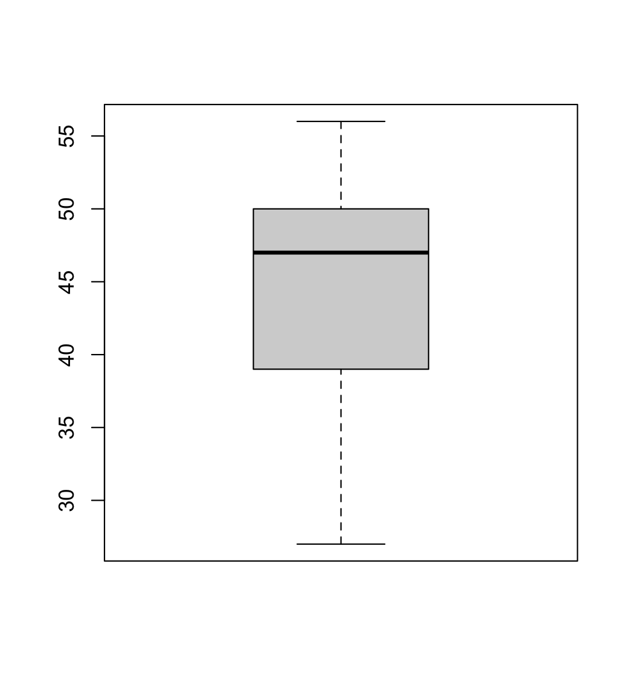
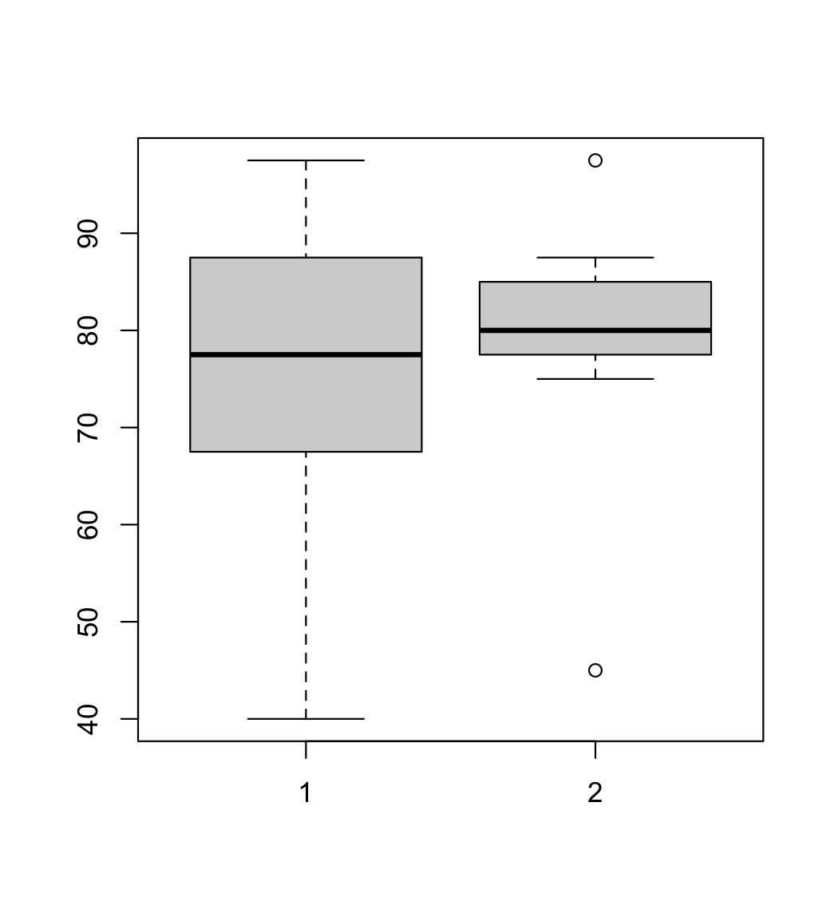

# 데이터 가공

### 데이터 결합

#### 세로결합 :  UNION

* bind_rows()

#### 가로결합 : JOIN

* left_join : 왼쪽 테이블에 갖다 붙여
* inner_join : 조건에 맞는 것만 붙여
* full_join : 전체 다 붙여

```r
> library(readxl)
> y16 <- read_excel("R-Data/y16.xlsx")
> y17 <- read_excel("R-Data/y17.xlsx")                                                  
> typeof(y16)                                                                       
[1] "list"
> typeof(y17)
[1] "list"
```

```r
> y16 <- as.data.frame(read_excel("R-Data/y16.xlsx"))
> y17 <- as.data.frame(read_excel("R-Data/y17.xlsx"))                                   
> typeof(y16)                                                                           
[1] "list"
> typeof(y17)
[1] "list"
```

```r
> library(dplyr) #join 연산을 위한 라이브러리 로드
> r1 <- left_join(y16,y17,by="ID")
> r1
  ID  AMT16 Y16_CNT  SEX AGE AREA   AMT17 Y17_CNT
1  1 100000      40    F  50 서울 1300000      50
2  2 700000      30    M  40 경기  450000      25
3  3  50000       5 <NA>  NA <NA>      NA      NA
4  4 125000       3    M  50 서울  400000       8
5  5 760000      28    M  27 서울  845000      30
6  6 300000       6 <NA>  NA <NA>      NA      NA
7  7 130000       2    F  56 경기  150000       2
8  8 400000       7    F  47 서울  570000      10
9 10 550000      16    F  38 경기  520000      17

> r2 <- left_join(y17,y16,by="ID")
> r2
  ID SEX AGE AREA   AMT17 Y17_CNT  AMT16 Y16_CNT
1  1   F  50 서울 1300000      50 100000      40
2  2   M  40 경기  450000      25 700000      30
3  4   M  50 서울  400000       8 125000       3
4  5   M  27 서울  845000      30 760000      28
5  7   F  56 경기  150000       2 130000       2
6  8   F  47 서울  570000      10 400000       7
7  9   M  20 인천  930000       4     NA      NA
8 10   F  38 경기  520000      17 550000      16
```


#### Q1. 16, 17년 결제 금액의 합, 건수의 합을 테이블에 추가하시오. 

##### Solution 1: 

`SUM_AMT`, `SUM_CNT`

1. full_join 수행

   ```r
   > r3 <- full_join(y16,y17,by="ID")
   > r3
      ID  AMT16 Y16_CNT  SEX AGE AREA   AMT17 Y17_CNT
   1   1 100000      40    F  50 서울 1300000      50
   2   2 700000      30    M  40 경기  450000      25
   3   3  50000       5 <NA>  NA <NA>      NA      NA
   4   4 125000       3    M  50 서울  400000       8
   5   5 760000      28    M  27 서울  845000      30
   6   6 300000       6 <NA>  NA <NA>      NA      NA
   7   7 130000       2    F  56 경기  150000       2
   8   8 400000       7    F  47 서울  570000      10
   9  10 550000      16    F  38 경기  520000      17
   10  9     NA      NA    M  20 인천  930000       4
   ```

   

2. 결측값 처리 (NA -> 0)

   ```r
   > r3_2 <- r1
   > r3_2[is.na(r1_2)] = 0
   > r3_2
     ID  AMT16 Y16_CNT SEX AGE AREA   AMT17 Y17_CNT
   1  1 100000      40   F  50 서울 1300000      50
   2  2 700000      30   M  40 경기  450000      25
   3  3  50000       5   0   0    0       0       0
   4  4 125000       3   M  50 서울  400000       8
   5  5 760000      28   M  27 서울  845000      30
   6  6 300000       6   0   0    0       0       0
   7  7 130000       2   F  56 경기  150000       2
   8  8 400000       7   F  47 서울  570000      10
   9 10 550000      16   F  38 경기  520000      17
   ```

   

3. rowSums 활용

   ```r
   > r3_2$SUM_AMT <- rowSums(r3_2[,c(2,7)])
   > r3_2$SUM_CNT <- rowSums(r3_2[,c(3,8)])
   > r3_2
      ID  AMT16 Y16_CNT SEX AGE AREA   AMT17 Y17_CNT SUM_AMT SUM_CNT
   1   1 100000      40   F  50 서울 1300000      50 1400000      90
   2   2 700000      30   M  40 경기  450000      25 1150000      55
   3   3  50000       5   0   0    0       0       0   50000       5
   4   4 125000       3   M  50 서울  400000       8  525000      11
   5   5 760000      28   M  27 서울  845000      30 1605000      58
   6   6 300000       6   0   0    0       0       0  300000       6
   7   7 130000       2   F  56 경기  150000       2  280000       4
   8   8 400000       7   F  47 서울  570000      10  970000      17
   9  10 550000      16   F  38 경기  520000      17 1070000      33
   10  9      0       0   M  20 인천  930000       4  930000       4
   ```


##### Solution 2: 

1. full_join 수행

   ```r
   > r4 <- full_join(y16,y17,by="ID")
   ```

2. rowSums 

   ```r
   > r4$SUM_AMT <- rowSums(r4 %>% select(AMT17, AMT16), na.rm = T)
   > r4$SUM_CNT <- rowSums(r4 %>% select(Y17_CNT, Y16_CNT), na.rm = T)
   > r4
      ID  AMT16 Y16_CNT  SEX AGE AREA   AMT17 Y17_CNT SUM_AMT SUM_CNT
   1   1 100000      40    F  50 서울 1300000      50 1400000      90
   2   2 700000      30    M  40 경기  450000      25 1150000      55
   3   3  50000       5 <NA>  NA <NA>      NA      NA   50000       5
   4   4 125000       3    M  50 서울  400000       8  525000      11
   5   5 760000      28    M  27 서울  845000      30 1605000      58
   6   6 300000       6 <NA>  NA <NA>      NA      NA  300000       6
   7   7 130000       2    F  56 경기  150000       2  280000       4
   8   8 400000       7    F  47 서울  570000      10  970000      17
   9  10 550000      16    F  38 경기  520000      17 1070000      33
   10  9     NA      NA    M  20 인천  930000       4  930000       4
   ```

   

#### Q2. 위의 데이터를 기준으로 지역별 사용금액 평균, 사용 횟수의 평균을 구하시오

`AVG_AMT`, `AVG_CNT`

row 데이터를 변경하는 건 바람직하지 않으므로 `r4_2` 에 따로 저장 후 `is.na()` 연산 수행하여 결측치 처리

```r
> r4_2 <- r4 %>% group_by(AREA) %>% summarise(AVG_AMT=mean(SUM_AMT),
+                                     AVG_CNT=mean(SUM_CNT))
`summarise()` ungrouping output (override with `.groups` argument)
> r4_2$AREA <- ifelse(is.na(r4_2$AREA), 'NONE', r4_2$AREA)
> r4_2 <- as.data.frame(r4_2)
> r4_2
  AREA   AVG_AMT  AVG_CNT
1 경기  833333.3 30.66667
2 서울 1125000.0 44.00000
3 인천  930000.0  4.00000
4 NONE  175000.0  5.50000
```


### 빈도분석 : `frequency`

```r
> r5
  ID  AMT16 Y16_CNT SEX AGE AREA   AMT17 Y17_CNT
1  1 100000      40   F  50 서울 1300000      50
2  2 700000      30   M  40 경기  450000      25
3  4 125000       3   M  50 서울  400000       8
4  5 760000      28   M  27 서울  845000      30
5  7 130000       2   F  56 경기  150000       2
6  8 400000       7   F  47 서울  570000      10
7 10 550000      16   F  38 경기  520000      17
```

```r
> fq <- freq(r5$AREA, plot=T)
> fq
r5$AREA 
      Frequency Percent
경기          3   42.86
서울          4   57.14
Total         7  100.00010
```


### 그래프 그리기

#### 히스토그램

```r
> hist(r5$AGE)
```


#### 막대그래프

```r
boxplot(r5$AGE)
```



# Workshop

교재 p.150~ 151 `day02ws.r`

## 01.

`mid_exam` 의 수학점수의 변수명을 `MATH_MID`, 영어점수의 변수명을 `ENG_MID`로 변환하고 결과를 확인하라

```r
> mid_exam <- as.data.frame(read_excel("R-Data/mid_exam.xlsx"))
> mid_exam <- mid_exam %>% rename("MATH_MID"="MATH") %>% rename("ENG_MID"="ENG")
> mid_exam
   CLASS ID MATH_MID ENG_MID
1      1  1       30      40
2      1  2      100      95
3      1  3       95      90
4      1  4       70      80
5      1  5       80      90
6      1  6       85      90
7      1  7       50      70
8      1  8        0      30
9      1  9       60      80
10     1 10       85      85
```


## 02.

`final_exam` 의 수학점수의 변수명을 `MATH_FINAL`, 영어점수의 변수명을 `ENG_FINAL`로 변환하고 결과를 확인하라

```r
> final_exam <- as.data.frame(read_excel("R-Data/final_exam.xlsx"))
> final_exam <- final_exam %>% rename("MATH_FIANL"="MATH") %>% rename("ENG_FINAL"="ENG")
> final_exam
  ID MATH_FIANL ENG_FINAL
1  1         50        50
2  2         95       100
3  3         80        85
4  4         80        80
5  5         90        80
6  6         70        80
7  7         60        80
8  9         75        75
9 10         90        75
```


## 03.

중간고사와 기말고사 성적 데이터 중 중간고사와 기말고사 성적이 모두 있는 데이터를 가로 결합한 후 `total_exam` 에 저장한다.

```r
> total_exam <- inner_join(mid_exam,final_exam,by="ID")
> total_exam
  CLASS ID MATH_MID ENG_MID MATH_FIANL ENG_FINAL
1     1  1       30      40         50        50
2     1  2      100      95         95       100
3     1  3       95      90         80        85
4     1  4       70      80         80        80
5     1  5       80      90         90        80
6     1  6       85      90         70        80
7     1  7       50      70         60        80
8     1  9       60      80         75        75
9     1 10       85      85         90        75
```


## 04.

중간고사와 기말고사를 결합한 `total_exam`  변수를 활용해 수학점수와 영어점수의 개별 평균을 각각 구한 후 `MATH_AVG`, `ENG_AVG`  변수에 추가한다.

```r
> total_exam <- inner_join(mid_exam,final_exam,by="ID")
> total_exam$MATH_AVG <- rowMeans(total_exam[,c(3,5)])
> total_exam$ENG_AVG <- rowMeans(total_exam[,c(4,6)])
> total_exam
  CLASS ID MATH_MID ENG_MID MATH_FIANL ENG_FINAL MATH_AVG ENG_AVG
1     1  1       30      40         50        50     40.0    45.0
2     1  2      100      95         95       100     97.5    97.5
3     1  3       95      90         80        85     87.5    87.5
4     1  4       70      80         80        80     75.0    80.0
5     1  5       80      90         90        80     85.0    85.0
6     1  6       85      90         70        80     77.5    85.0
7     1  7       50      70         60        80     55.0    75.0
8     1  9       60      80         75        75     67.5    77.5
9     1 10       85      85         90        75     87.5    80.0
```


## 05.

성적이 모두 입력된 9명의 학생별 평균을 구한 후 `TOTAL_AVG` 변수에 추가한다.

```r
> total_exam$TOTAL_AVG <- rowMeans(total_exam[,c(3:6)])
> total_exam
  CLASS ID MATH_MID ENG_MID MATH_FIANL ENG_FINAL MATH_AVG ENG_AVG TOTAL_AVG
1     1  1       30      40         50        50     40.0    45.0     42.50
2     1  2      100      95         95       100     97.5    97.5     97.50
3     1  3       95      90         80        85     87.5    87.5     87.50
4     1  4       70      80         80        80     75.0    80.0     77.50
5     1  5       80      90         90        80     85.0    85.0     85.00
6     1  6       85      90         70        80     77.5    85.0     81.25
7     1  7       50      70         60        80     55.0    75.0     65.00
8     1  9       60      80         75        75     67.5    77.5     72.50
9     1 10       85      85         90        75     87.5    80.0     83.75
```


## 06.

`total_exam` 에서 수학 점수와 영어 점수의 전체 평균을 구하라.

```r
> colMeans(total_exam[c(7)])
MATH_AVG 
74.72222 
> colMeans(total_exam[c(8)])
 ENG_AVG 
79.16667 
```


## 07.

중간고사 수학 점수가 80점 이상이고, 중간고사 영어 점수가 90점 이상인 학생을 출력하라

```r
> total_exam %>% filter(MATH_MID>=80, ENG_MID>=90)
  CLASS ID MATH_MID ENG_MID MATH_FIANL ENG_FINAL MATH_AVG ENG_AVG TOTAL_AVG
1     1  2      100      95         95       100     97.5    97.5     97.50
2     1  3       95      90         80        85     87.5    87.5     87.50
3     1  5       80      90         90        80     85.0    85.0     85.00
4     1  6       85      90         70        80     77.5    85.0     81.25
```


## 08.

수학 점수 평균과 영어 점수 평균에 대한 상자 그림을 그려라

```r
> boxplot(total_exam$MATH_AVG, total_exam$ENG_AVG)
```




