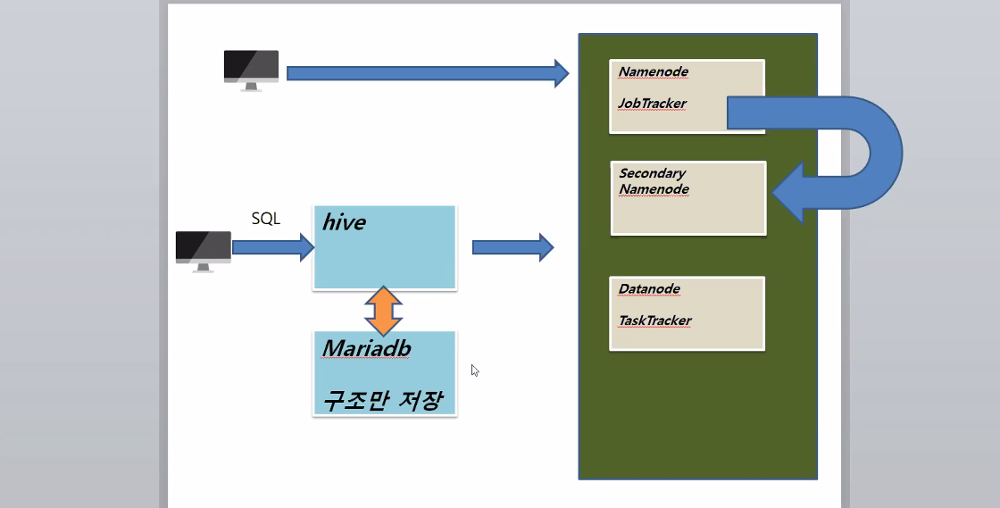
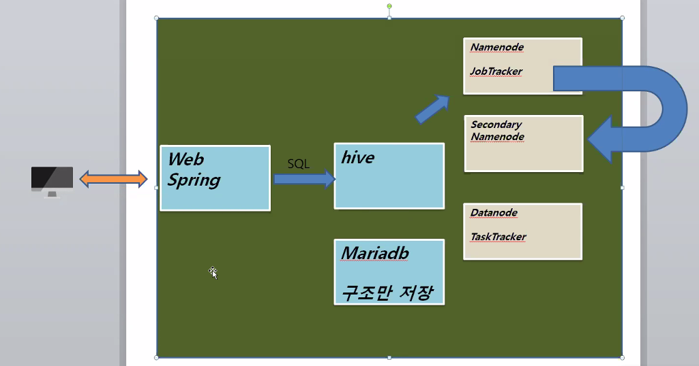
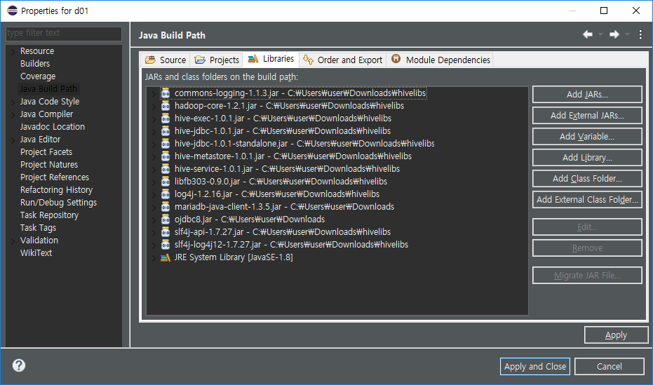

# HIVE 설치

> Hadoop P.564



1. MariaDB 설치 후 root로그인 > hive 사용자 생성

    ```bash
    $ mysql -h localhost  -u  root  -p
    ```

    ```sql
    MariaDB [(none)]> 
    use mysql;
    GRANT   ALL   ON   *.*  TO   hive@'127.0.0.1'  IDENTIFIED  BY  '111111';
    GRANT   ALL   ON   *.*  TO   hive@'localhost'  IDENTIFIED  BY  '111111';
    GRANT   ALL   ON   *.*  TO   hive@'192.168.111.120'  IDENTIFIED  BY  '111111';
    GRANT   ALL   ON   *.*  TO   hive@'hadoop'  IDENTIFIED  BY  '111111';
    exit;
    ```
    ```
    2. hive로 로그인 가능

        ```bash
        $ mysql -h localhost  -u  hive  -p
    ```

    ```sql
    CREATE DATABASE hive_db;
    exit;
    ```

2. hive 설치

    >  /usr/local

    ```bash
    $ wget https://archive.apache.org/dist/hive/hive-1.0.1/apache-hive-1.0.1-bin.tar.gz
    $ tar xvf apache-hive-1.0.1-bin.tar.gz
    $ mv apache-hive-1.0.1-bin hive
    $ cp -r hive /usr/local
    ```

3. hive 라이브러리에 MariaDB 자바 클라이언트 추가

    ```bash
    $ cp mariadb-java-client-1.3.5.jar /usr/local/hive/lib
    ```

4. 환경설정 : hive-site.xml

    ```bash
    $ cd /usr/local/hive/conf
    $ vi hive-site.xml
    ```

    ```xml
    <?xml version="1.0"?>
    <?xml-stylesheet type="text/xsl" href="configuration.xsl"?>
    <configuration>
        <property>
            <name>hive.metastore.local</name> <!-- 메타스토어 -->
            <value>false</value>
            <description>controls whether to connect to remove metastore server or open a new metastore server in Hive Client JVM</description>
        </property>
        <property>
            <!-- 메타스토어 정보를 마리아 DB에 저장하겠다 -->
            <name>javax.jdo.option.ConnectionURL</name> 
            <value>jdbc:mariadb://localhost:3306/hive_db? createDatabaseIfNotExist=true</value>
            <description>JDBC connect string for a JDBC metastore</description>
        </property>
        <property>
            <name>javax.jdo.option.ConnectionDriverName</name> 
            <value>org.mariadb.jdbc.Driver</value>
            <description>Driver class name for a JDBC metastore</description>
        </property>
        <!-- 마리아 DB 계정정보 설정 -->
        <property>
            <name>javax.jdo.option.ConnectionUserName</name>
            <value>hive</value>
            <description>username to use against metastore database</description>
        </property>
        <property>
            <name>javax.jdo.option.ConnectionPassword</name>
            <value>111111</value>
            <description>password to use against metastore database</description>
        </property>
    </configuration>
    ```

5. 환경설정 /etc/profile

    ```bash
    $ cd /etc/profile
    ```

    > 순서 달라도 실행 안될 수 있으니 주의!

    ```bash
    52 JAVA_HOME=/usr/local/jdk1.8.0
    53 CLASSPATH=/usr/local/jdk1.8.0/lib
    54 HADOOP_HOME=/usr/local/hadoop-1.2.1
    55 HIVE_HOME=/usr/local/hive
    56 
    57 export JAVA_HOME CLASSPATH HADOOP_HOME HIVE_HOME
    58 
    59 PATH=$JAVA_HOME/bin:$HADOOP_HOME/bin:$HIVE_HOME/bin:.:$PATH
    ```

6. hive가 hadoop을 쓸거야!

    ```bash
    # 하둡실행
    $ start-all.sh
    # 폴더 생성 
    $ hadoop fs -mkdir /tmp 
    $ hadoop fs -mkdir /tmp/hive
    $ hadoop fs -mkdir /user/root/warehouse
    # 권한 부여
    $ hadoop fs -chmod 777 /tmp
    $ hadoop fs -chmod 777 /tmp/hive
    $ hadoop fs -chmod 777 /user/root/warehouse
    ```

7.  hive 실행

    ```bash
    $ hive
    hive>
    ```


# HIVE QL

> p.570

1. hive 실행

   > 반드시 하둡, mysql 실행이 선행되어야 함!
   >
   > hive 실행 안될 경우 stop-all.sh 하고 다시 실행해보깅~

   ```bash
   $ start-all.sh
   $ hive
   ```

2. 데이터 테이블 작성 

   ```sql
   hive> CREATE TABLE HDI(id INT, country STRING, hdi FLOAT, lifeex INT, mysch INT, eysch INT, gni INT) ROW FORMAT DELIMITED FIELDS TERMINATED BY ',' STORED AS TEXTFILE;
   ```

3. 파일 업로드

   > 카페에 있는 hdi-data.csv를 txt로 변환 후 root 폴더로 옮김

   ```bash
   $ mv hdi-data.csv hdi.txt
   $ cp hdi.txt /root
   ```

   > hive에서 데이터 로드

   ```sql
   hive> load data local inpath '/root/hdi.txt' into table HDI;
   ```

4. 데이터 확인

   ```sql
   hive> select * from hdi limit 5;
   OK
   NULL		NULL	NULL	NULL	NULL	NULL
   1	Norway	0.943	81	12	17	47557
   2	Australia	0.929	81	12	18	34431
   3	Netherlands	0.91	80	11	16	36402
   4	United States	0.91	78	12	16	43017
   Time taken: 0.322 seconds, Fetched: 5 row(s)
   ```


### 데이터 활용 해보기

1. 테이블 생성 선행

```sql
CREATE TABLE airline_delay(
Year INT, MONTH INT, DayofMonth INT, DayofWeek INT, DepTime INT,CRSDepTime INT, ArrTime INT,CRSArrTime INT,UniqueCarrier STRING,FlightNum INT,TailNum STRING,ActualElapsedTime INT,CRSElapsedTime INT,AirTime INT,ArrDelay INT,DepDelay INT,Origin STRING,Dest STRING,Distance INT,TaxiIn INT,TaxiOut INT,Cancelled INT,
CancellationCode STRING COMMENT 'A = carrier, B = weather, C = NAS, D = security',Diverted INT COMMENT '1 = yes, 0 = no',CarrierDelay STRING,WeatherDelay STRING,NASDelay STRING,SecurityDelay STRING,LateAircraftDelay STRING)COMMENT 'TEST DATA'
PARTITIONED BY (delayYear INT)ROW FORMAT DELIMITEDFIELDS 
TERMINATED BY ','LINES TERMINATED BY '\n'
STORED AS TEXTFILE;
```

2. OVERWRITE

   덮어쓰기 옵션 : 이 옵션 없으면 기존 데이터는 그대로 두고 새로운 데이터가 쌓임

```sql
hive> LOAD DATA LOCAL INPATH '/root/2006.csv' INTO TABLE airline_delay
    > PARTITION (delayYear='2006');  
```

3. 쿼리문으로 데이터 조회 가능

   > 맵리듀스? 라는게 필요한데 굉장히 복잡한 프로그래밍
   >
   > 대신 MariaDB 거쳐서 데이터 다룰 수 있음

```sql
hive> SELECT year, month, deptime, arrtime, flightnum FROM airline_delay
    > WHERE delayYear='2006'
    > LIMIT 10;
OK
NULL	NULL	NULL	NULL	NULL
2006	1	743	1024	343
2006	1	1053	1313	613
2006	1	1915	2110	617
2006	1	1753	1925	300
2006	1	824	1015	765
2006	1	627	834	295
2006	1	825	1041	349
2006	1	942	1155	356
2006	1	1239	1438	775
Time taken: 0.472 seconds, Fetched: 10 row(s)
```


## Eclipse에서 Java로 Hive 실행하기

0. Java, Spring으로 실행할 경우 개념도



1. 자바 대기 상태 진입

```bash
$ hive --service hiveserver2
```

2. Eclipse 자바 프로젝트에 라이브러리 임포트

   >  hivelibs.zip

   

3. Java (HiveTest.java)

   ```bash
   package d01;
   
   import java.sql.Connection;
   import java.sql.DriverManager;
   import java.sql.PreparedStatement;
   import java.sql.ResultSet;
   
   public class HiveTest {
   	public static void main(String[] args) throws Exception {
   		String url = "jdbc:hive2://192.168.111.120:10000/default";
   		String userid = "root";
   		String password = "111111";
   		Class.forName("org.apache.hive.jdbc.HiveDriver");
   		Connection con = DriverManager.getConnection(url, userid, password);
   		PreparedStatement pstmt = con.prepareStatement(
   				"SELECT Year, avg(ArrDelay), avg(depDelay) FROM airline_delay\r\n" + 
   				"WHERE delayYear=2007\r\n" + 
   				"GROUP BY Year");
   		ResultSet rset = pstmt.executeQuery();
   		while(rset.next()) {
   			String s1 = rset.getString(1);
   			String s2 = rset.getString(2);
   			String s3 = rset.getString(2);
   			System.out.println(s1+" "+s2+" "+s3);
   		}
   		con.close();
   	}
   }
   ```

   * Hadoop 서버 커맨드창

     ```bash
     Query ID = root_20200924160505_9d4f7fc1-5aeb-4b95-a288-d59f61f625dd
     Total jobs = 1
     Launching Job 1 out of 1
     Number of reduce tasks not specified. Estimated from input data size: 3
     In order to change the average load for a reducer (in bytes):
       set hive.exec.reducers.bytes.per.reducer=<number>
     In order to limit the maximum number of reducers:
       set hive.exec.reducers.max=<number>
     In order to set a constant number of reducers:
       set mapred.reduce.tasks=<number>
     Starting Job = job_202009241600_0001, Tracking URL = http://localhost:50030/jobdetails.jsp?jobid=job_202009241600_0001
     Kill Command = /usr/local/hadoop-1.2.1/libexec/../bin/hadoop job  -kill job_202009241600_0001
     Hadoop job information for Stage-1: number of mappers: 3; number of reducers: 3
     2020-09-24 16:05:41,594 Stage-1 map = 0%,  reduce = 0%
     2020-09-24 16:05:57,072 Stage-1 map = 17%,  reduce = 0%
     2020-09-24 16:06:00,201 Stage-1 map = 25%,  reduce = 0%
     2020-09-24 16:06:03,252 Stage-1 map = 50%,  reduce = 0%
     2020-09-24 16:06:05,400 Stage-1 map = 58%,  reduce = 0%, Cumulative CPU 23.52 sec
     2020-09-24 16:06:06,474 Stage-1 map = 67%,  reduce = 0%, Cumulative CPU 46.67 sec
     2020-09-24 16:06:15,752 Stage-1 map = 94%,  reduce = 0%, Cumulative CPU 46.67 sec
     2020-09-24 16:06:16,775 Stage-1 map = 100%,  reduce = 0%, Cumulative CPU 56.31 sec
     2020-09-24 16:06:22,897 Stage-1 map = 100%,  reduce = 33%, Cumulative CPU 56.31 sec
     2020-09-24 16:06:23,958 Stage-1 map = 100%,  reduce = 67%, Cumulative CPU 65.57 sec
     2020-09-24 16:06:32,079 Stage-1 map = 100%,  reduce = 100%, Cumulative CPU 69.12 sec
     MapReduce Total cumulative CPU time: 1 minutes 9 seconds 120 msec
     Ended Job = job_202009241600_0001
     MapReduce Jobs Launched: 
     Stage-Stage-1: Map: 3  Reduce: 3   Cumulative CPU: 69.12 sec   HDFS Read: 702920320 HDFS Write: 42 SUCCESS
     Total MapReduce CPU Time Spent: 1 minutes 9 seconds 120 msec
     OK
     ```

   * Eclipse 실행 결과

     ```bash
     2007	10.19218057072105	10.19218057072105
     ```

     

## Workshop

1. hadoop2 서버에 hadoop, MySQL 실행
2. HIVE 설치
3. HIVE 예제 실행
4. ari data 입력 및 분석
5. Java Application 구현하여 hive와 연동