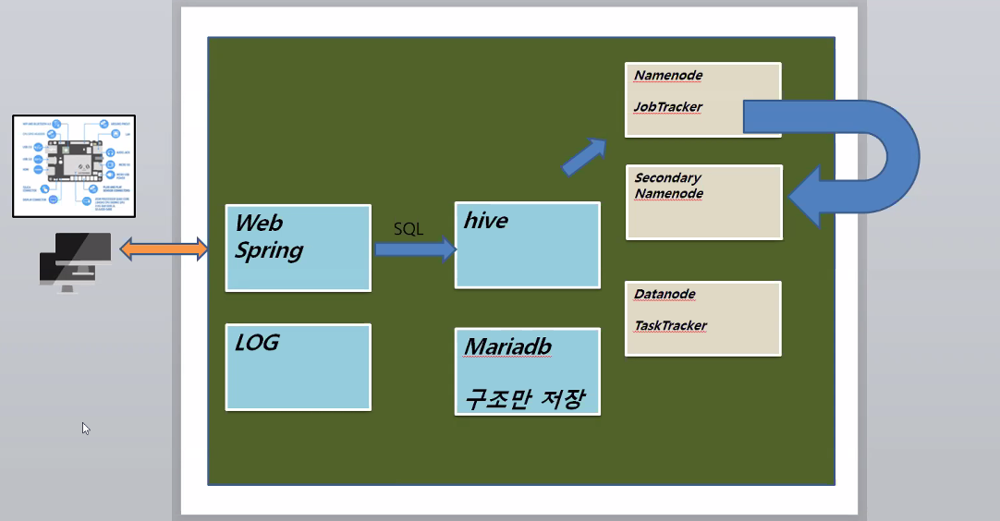

## Web Application에서 로그를 찍어보자


```java
package hive;

import javax.servlet.http.HttpServletRequest;

import org.springframework.stereotype.Controller;
import org.springframework.web.bind.annotation.RequestMapping;
import org.springframework.web.servlet.ModelAndView;

@Controller
public class ShopController {
	@RequestMapping("/shop.mc")
	public ModelAndView main(HttpServletRequest req) {
		ModelAndView mv = new ModelAndView();
		String id = req.getParameter("id");
		String item = req.getParameter("item");
		String price = req.getParameter("price");
		System.out.println(id+" "+item+" "+price);
		
		mv.setViewName("main");
		return mv;
	}
}
```

### Log4j 적용

기존 log4j 버전을 1.2.17로 업그레이드

> 128 line

```xml
<dependency>
	<groupId>log4j</groupId>
	<artifactId>log4j</artifactId>
	<version>1.2.17</version>
</dependency> 
```

 	1. 수정 후 Eclipse Project Explorer에서 pom.xml 우클릭
 	2. Maven - Update Project

라이브러리 확인 가능

```bash
C:\Users\user\.m2\repository\log4j\log4j
```


web.xml 변경

> 42 line

```xml
<listener>
      <listener-class>org.springframework.web.util.Log4jConfigListener</listener-class>
</listener>
<context-param>
      <param-name>log4jConfigLocation</param-name>
      <param-value>/WEB-INF/config/log4j.properties</param-value>
</context-param>
```

다운로드 받은 `log4j.properties` 다운로드 받아


expected at least 1 bean which qualifies as autowire candidate for this dependency

오류 > spring.xml

```xml
<context:component-scan base-package="com.*" />
```


리눅스에서 구현




Hadoop에서 로그기록 운용을 위한 MariaDB 테이블 구조 선언

```sql
CREATE TABLE shopclick(
    date    STRING,
    fn      STRING,
    id      STRING,
    item    STRING,
    price   INT,
    age     INT,
    gender  STRING    
)
PARTITIONED BY (logdate)
ROW FORMAT DELIMITED
    FIELDS TERMINATED BY ','
    LINES TERMINATED BY '\n'
    STORED AS TEXTFILE;
```


크론캣? 크롬탭?

`cd` root에 `vi hive.sh`

```sh
#!/bin/sh

date=`date`
echo $date
partitionName="${date:0:4}-${date:6:2}-${date:10:2}"
echo $partitionName
fileName="data.log.$partitionName"
echo $fileName
```

> partitionName="${date:0:4}-${date:6:2}-${date:10:2}" 
>
> 연 월 일을 기준으로 파티션

 동작 확인

```bash
$ chmod 777 hive.sh
$ hive.sh
2020. 09. 29. (화) 18:16:52 KST
2020-09-29
data.log.2020-09-29
```

hive.sh 밑에 추가

> 오늘 날짜가 확장자로 되어있는 파일을 로드 ex) data.log.2020-09-28

```sh
echo "Load the Data ?"
read yn
if [ $yn == "y" ]
then
echo "Start Load the Data ..."
if [ -f /root/logs/$fileName ]
then
hive << EOF
LOAD DATA LOCAL INPATH '/root/logs/$fileName' OVERWRITE INTO TABLE shopclick PARTITION (logdate="$partitionName");
EOF
echo "OK"
echo "OK"
else
echo "File Not Found"
echo "Exit Now..."
fi
else
echo "Exit Now..."
fi
exit 0
```


1. hive 서버 설치 > 192.168.111.130
2. 프로그램설치 > JDK, Tomcat, MariaDB, Hadoop, Hive
3. Web Application > 기획, 구현, 로그
4. Hive 통해 Hadoop 저장
5. Hadoop 저장 된 데이터 분석하여 Chart 생성