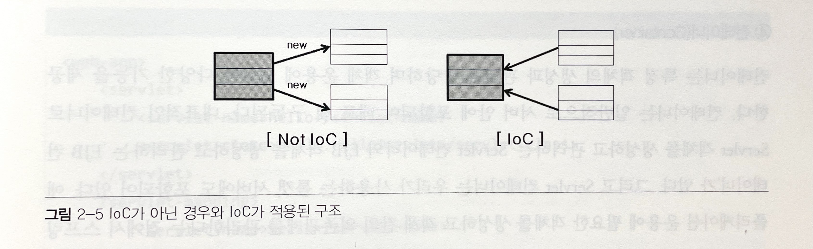
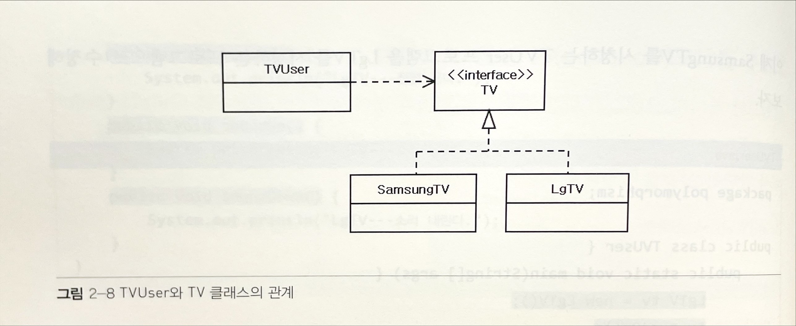
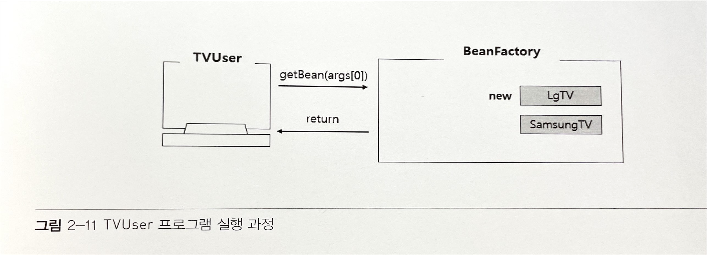
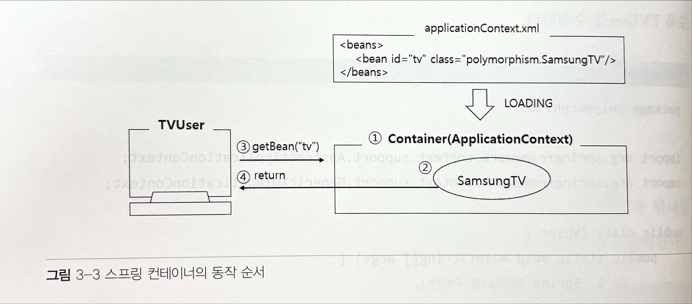

# 프레임 워크 개요

## 프레임 워크 개념

프레임워크는 개발에서 기본이 되는 뼈대나 틀을 제공한다. 즉, 개발자에게 모든 것을 위임하는 것이 아니라 어플레케이션의 기본 아키텍처는 프레임워크가 제공하고, 그 뼈대에 살을 붙이는 작업만 개발자가 하는 것이다.

## 프레임 워크 장점

잘 만들어진 프레임 워크를 사용하면 어플리케이션에 대한 분석, 설계, 구현 모두에서 재사용성이 증가한다.

* 빠른 구현 시간
* 쉬운 관리
* 개발자들의 역량 획일화
* 검증된 아키텍처의 재사용과 일관성 유지

## 스프링 프레임워크의 특징

"IoC와 AOP를 지원하는 경량의 컨테이너 프레임 워크"

### 경량

스프링은 크기 측면에서 가볍다. 

* 몇 개의 JAR 파일만 있으면 개발과 실행이 가능하다.

* 클래스 구현에 특별한 규칙이 없는 단순하고 가벼운 객체인 POJO (Plain Old Java Object) 형태의 객체를 관리한다.

### 제어의 역행 Inversion of Control

제어의 역행으로 `낮은 결합도` & `높은 응집도` 를 유지할 수 있다.



객체 생성을 자바 코드로 직접 처리하는 것이 아니라 컨테이너가 대신 처리한다. 또한 객체와 객체 사이의 의존관계 역시 컨테이너가 처리한다. 결과적으로 소스에 의존관계가 명시되지 않으므로 결합도가 떨어져 유지보수가 편리해진다.

### 관점지향 프로그래밍 AOP : Aspect Oriented Programming


각 메소드마다 반복해서 등장하는 공통 로직을 분리함으로써 응집도가 높게 개발할 수 있도록 지원한다.

공통으로 사용하는 기능들을 외부의 독립된 클래스로 분리하고, 해당 기능을 프로그램 코드에 직접 명시하지 않고 선언적으로 처리하여 적용하는 것이 관점지향 프로그래밍의 기본 개념이다. 이는 응집도가 높은 비즈니스 컴포넌트를 만들 수 있고 유지보수성을 향상시킬 수 있다.

#### 컨테이너

컨테이너는 특정 객체의 생성과 관리를 담당하며 객체 운용에 필요한 기능을 제공한다. 일반적으로 서버 안에 포함되어 배포, 구동된다. Servlet 컨테이너는 톰캣 서버에도 포함되어 있다.

## IoC(Inversion of Control) 컨테이너

스프링 프레임워크를 이해하는 데 가장 중요한 개념이 컨테이너이다.

서블릿 컨테이너의 동작 순서

1. WEB-INF/web.xml 파일을 로딩하여 구동
2. 브라우저로부터 /hello.do 요청 수신
3. hello.HelloServlet 클래스를 찾아 객체를 생성하고 doGet() 메서드 호출
4. doGet() 메서드 실행 결괄르 클라이언트 브라우저에 전송

### 다형성을 이용하여 결합도 낮추기

다형성 Polymorphism을 이용하면 결합도를 낮출 수 있다.



TV 클래스들의 최상위 부모로 사용할 TV 인터페이스를 추가하고, 모든 TV가 공통으로 가져야 할 메소드를 추상 메소드로 선언한다. `implements TV` 를 추가해 TV 인터페이스에 선언된 추상 메소드들을 재정의한다

이를 활용하면 클라이언트 프로그램이 여러 개 있더라도 최소한의 수정으로 TV를 교체할 수 있다. 유지보수가 편리하다.

### 디자인 패턴 이용하기

TV를 교체할 때, 클라이언트 소스를 수정하지 않고 TV를 교체할 수 있다면 유지보수는 더욱 편할 것이다. 이는 Factory 패턴을 적용하여 구현가능하다. Factory 패턴은 클라이언트에서 사용할 객체 생성을 캡슐화하여 TV사이를 느슨한 결합 상태로 만들어 준다.

#### beanFactory.java

```java
package polymorphism;

public class BeanFactory {
	public Object getBean(String beanName) {
		if(beanName.equals("samsung")) {
			return new SamsungTV();
		} else if(beanName.equals("lg")) {
			return new LgTV();
		}
		return null;
	}
}
```

#### TVUser.java

```java
package polymorphism;

public class TVUser {
	public static void main(String[] args) {
		BeanFactory factory = new BeanFactory(); // beanFactory
		TV tv = (TV)factory.getBean(args[0]);
		tv.powerOn();
		tv.powerOff();
		tv.volumeUp();
		tv.volumeDown();
	}
}
```

beanFactory가 TV 객체를 생성하여 리턴함. TVUser는 자신이 필요한 객체를 직접 생성하지 않는다. TVUser는 단지 객체가 필요하다는 것을 BeanFactory에 요청했을 뿐이고, BeanFactory는 클라이언트가 사용할 TV 객체를 적절하게 생성하여 넘겨주었다. 이로써 TVUser는 TV가 변경될 때 마다 소스를 수정할 필요가 없게 된다.



# 스프링 컨테이너 및 설정 파일

`src/main/java` 에 [new] > [Other] > [Spring Bean Configuration File] > `applicationContext.xml` 

```xml
<?xml version="1.0" encoding="UTF-8"?>
<beans xmlns="http://www.springframework.org/schema/beans"
	xmlns:xsi="http://www.w3.org/2001/XMLSchema-instance"
	xsi:schemaLocation="http://www.springframework.org/schema/beans http://www.springframework.org/schema/beans/spring-beans.xsd">

	<bean id="tv" class="polymorphism.SamsungTV"></bean>
</beans>
```

SamsungTV 클래스 를 스프링 설정 파일에 등록




1. TVUser 클라이언트가 스프링 설정 파일을 로딩하여 컨테이너 구동
2. 스프링 설정 파일에 <bean> 등록된 SamsungTV 객체 생성
3. getBean() 메서드로 이름이 'tv' 인 객체를 요청(Lookup)
4. SamsungTV 객체 반환

TV를 LgTV로 변경할 때 applicationContext.xml 파일만 수정하면 된다.  TVUser 클라이언트 소스를 수정하지 않고도 동작하는 TV를 변경할 수 있으며, 기존에 BeanFactory 클래스를 사용했던 것보다 유지보수가 좀 더 편해졌다.


## 스프링 컨테이너의 종류

* BeanFactory
* ApplicationFactory

### BeanFactory

* 스프링 설정 파일에 등록된 <bean> 객체를 생성하고 관리하는 가장 기본적인 컨테이너 기능 제공
* 클라이언트의 요청(Lookup)에 의해서만 <bean> 객체가 생성되는 방식 (지연로딩 Lazy Loading)

### ApplicationContext

* <bean> 기능 외에도 트랜잭션 관리, 메시지 기반의 다국어 처리 등의 다양한 기능 지원
* 컨테이너 구동 시점에 <bean> 등록된 클래스들을 객체 생성하는 즉시 로딩하는 방식 (즉시로딩 pre-loading)
* 웹어플리케이션 개발도 지원하므로 대부분의 스프링 프로젝트가 채택하는 컨테이너 방식

| 구현 클래스                  | 기능                                                         |
| ---------------------------- | ------------------------------------------------------------ |
| GenericXmlApplicationContext | 파일 시스템이나 클래스 경로에 있는 XML 설정 파일을 로딩하여 구동하는 컨테이너 |
| XmlWebApplicationContext     | 웹 기반의 스프링 어플리케이션 개발할 때 사용하는 컨테이너    |

## 스프링 XML 설정

