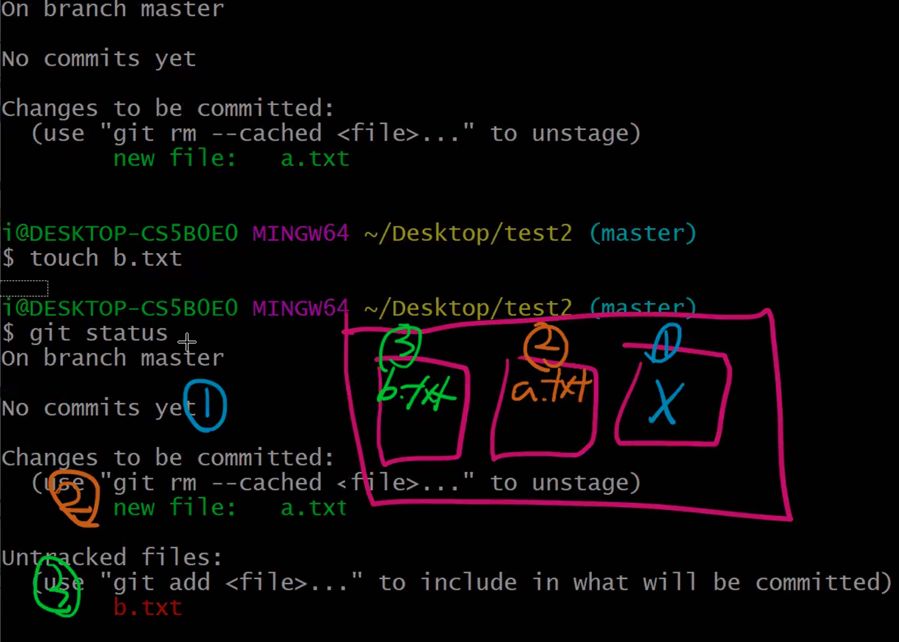

# Git

> Git은 분산형 버전관리 시스템

## Git 사전 준비

> git을 사용하기 전에 커밋을 남기는 사람에 대한 정보 설정(최초)

```bash
$git config --global user.name 'kcl***21'
$git config --global user.email 'kcl***21@naver.com'
```

* 추후에 commit을 하면, 작성한 사람(author)로 저장된다.

* email 정보는 github에 등록된 이메일로 설정하는 것을 추천(잔디밭)

* 설정 내용을 확인하기 위해서는 아래의 명령어를 입력한다.

  ```bash
  $ git config --global -l
  filter.lfs.clean=git-lfs clean -- %f
  filter.lfs.smudge=git-lfs smudge -- %f
  filter.lfs.process=git-lfs filter-process
  filter.lfs.required=true
  user.name=kcloud721
  user.email=kcloud721@naver.com
  ```
> git bash 설치 [링크](ㅗ)

# 기초 흐름

> 작업 ► add ► commit (3기통)


## 0. 저장소 설정

```bash
$ git init
Initialized empty Git repository in /Users/jh/gittest2/.git/
```

* git 저장소를 만들게 되면 해당 디렉토리 내에 `.git/` 폴더가 생성
* git bash에서는 `(master)` 로 현재 작업 중인 브랜치가 표기된다.

## 1. `add`

> 커밋을 위한 파일 목록 (staging area)

```bash
$ git add . 				# 현재 디렉토리의 모든 파일 및 폴더
$ git add a.txt			# 특정 파일
$	git add md-images	# 특정 폴더
$ git status
# master 브랜치에 있다.
On branch master

No commits yet
# 커밋이 될 변경사항들(changes)
# Staging area 단계
Changes to be committed:
	# unstage를 하기 위해서 ... 명령어
	# working directory 단계
  (use "git rm --cached <file>..." to unstage)
	new file:   a.txt

# 트래킹 되지 않은 파일들
# git으로 아직 관리 X
# working directory 단계
Untracked files:
	# commit 목록에 추가하려면 ...
	# 
  (use "git add <file>..." to include in what will be committed)
	b.txt
```




## 2. `commit`

> 버전을 기록(스냅샷)

```bash
$ git commit -m '커밋메시지'
```

* 커밋 메시지는 현재 버전을 알 수 있도록 명확하게 작성한다.

* 커밋 이력을 남기기 확인하기 위해서는 아래의 명령어를 입력한다.

  ```bash
  $ git log
  commit 352e43fd7931cece7e511e27124e1dbf2bf70644 (HEAD -> master)
  Author: kcloud721 <kcloud721@naver.com>
  Date:   Thu Sep 17 13:25:26 2020 +0900
  
      First commit
      
  $ git log -1 					# 최근 한 개의 버전
  $ git log --oneline 	# 한 줄로 간단하게 표현
  352e43f (HEAD -> master) First commit
  
  $ git log -1 --oneline 
  ```

## status - 상태 확인

> git에 대한 상태를 확인할 수 있다.

```bash
$ git status
```

# 원격 저장소 활용하기

> 원격 저장소를 제공하는 서비스는 github, gitlab, bitbucket 등이 있다.

### 1. 원격 저장소 설정하기

```bash
$ git remote add origin(URL)
```

> 깃아, 원격(remote)저장소로 추가해줘(add) origin이라는 이름으로 URL을

* 원격 저장소 삭제하기 위해서는 아래의 명령어를 사용한다

```bash
$ git remote rm origin
```


### 2. 원격 저장소 확인하기

```bash
$ git remote -v
origin	https://github.com/kcloud721/git-test.git (fetch)
origin	https://github.com/kcloud721/git-test.git (push)
```

### 3. push

```bash
$ git push origin master
Enumerating objects: 3, done.
Counting objects: 100% (3/3), done.
Delta compression using up to 4 threads
Compressing objects: 100% (2/2), done.
Writing objects: 100% (2/2), 234 bytes | 234.00 KiB/s, done.
Total 2 (delta 0), reused 0 (delta 0)
To https://github.com/kcloud721/git-test.git
   6f92c9a..2eb9a67  master -> master
```

* origin 원격저장소의 


  

  


